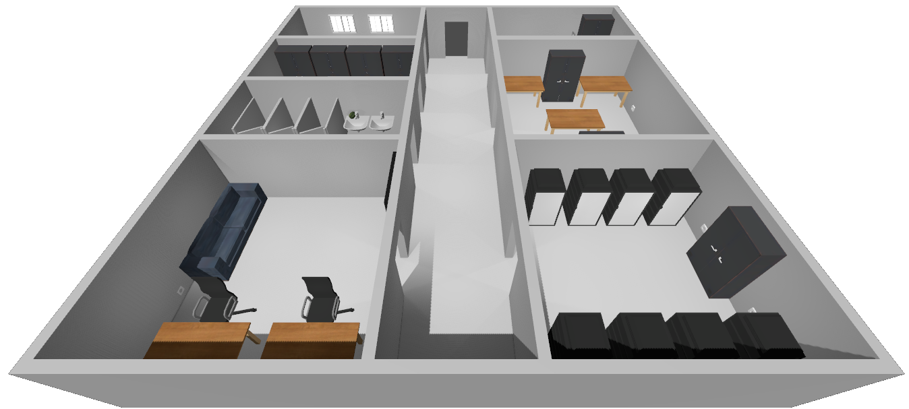

# secure-that-room

Этот симулятор разработан специально для замены бумажного варианта выполнения задачи, что дают первокурсникам инфобеза. Цель этого симулятора сделать задачу более приземленной и интерактивной.

Суть задачи заключается в том, что бы переработать/дополнить помещение так, что бы оно соответствовало актуальным ГОСТам РФ для определенного типа помещения.

Здесь содержится шесть доступных к редактированию помещений, рассчитанных на выполнение по вариантам, ~5 человек на бригаду.
- Коворкинг
- Архив
- Серверная
- Переговорная
- Лаборатория
- Мед-кабинет

К каждой комнате прилагается список ГОСТов, список открытых требований, и список скрытых требований.
Есть механики подключения электроприборов к цепи питания, нагрева и огнеопасности объектов, и потоков воздуха.
Пользователь симулятора может свободно добавлять/перемещать/удалять объекты в комнатах.
По завершению варианта симулятор выводит на экран соответствие проделанной работы всем требованиям.
